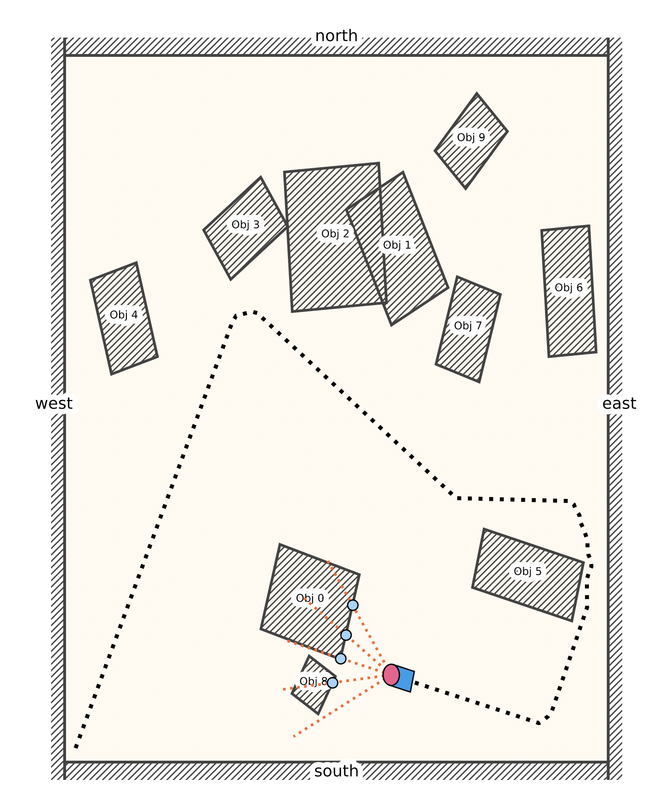

# SLAM

Playing around with SLAM implementation in Python and Julia.

Roadmap (working on Python only for now):
- [x] Environment
  - [x] create randomly populate environments with square objects
- [x] Agent
  - [x] LIDAR rays
    - [x] created LIDAR rays that can detect objects and report their distance to the agent
  - [x] navigation: agent goes in a straight line until LIDAR rays detect objects nearby, then steers to avoid them
- [ ] MAP - WIP
- [ ] localization - WIP

### TODO
- [ ] fix ray intersection: 
  - [ ] only positive range
  - [ ] only segment and not line
  - [ ] ceck with boundaries
- [ ] MAP remove movement and store stuff
- [ ] MAP plotting