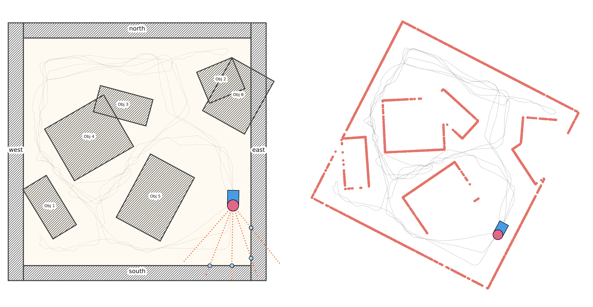
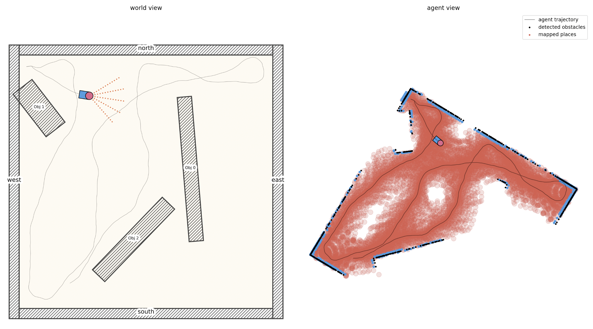
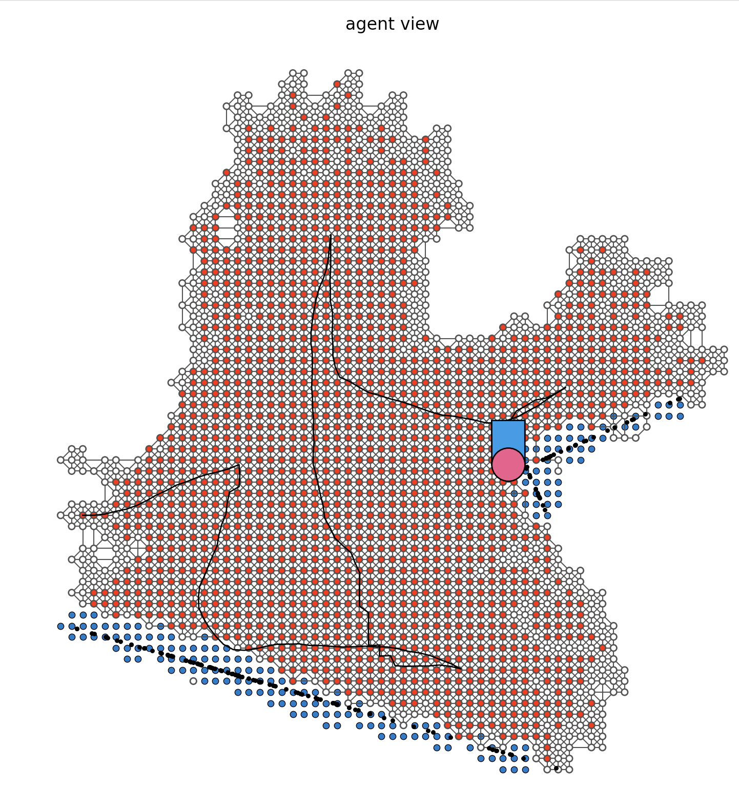

# SLAM

Playing around with SLAM implementation in Python.

This code sees a simple `Agent` moving in a 2D world populated by rectangular obstacles. The agent has lidar `Ray`s coming out of the head to detect objects nearby. They rays inform the agent of the distance of a detected object and the agent knows the angles that the rays are aimed at (with respect to the agent's body). This information, together with the agent's knowledge of its own movements (linear/angular velocity) is used to reconstruct the position of detected objects in the environment.

The agent builds a map starting from the first time it detects an object, that objects is set at the (0, 0) coordinate of a 2D Cartesian coordinate system. The agent's linear/angular velocity are then integrated to determine the agent's movement from the time of the first object detection in this 2D map, and every time another object is detect its position is noted. 
The 2D space is then populated with 2D Gaussian distributions. To know wether a location in space is accessible to the agent, nearby Gaussians are summed: those in positions in which no object was detected (i.e. where a lidar ray passed but did not cross an obstacle), the gaussians have a positive weight while those corresponding to detected objects have a strong negative weight. If the result of the sum is below zero, the point is not accessible otherwise it is. 

A 2D grid is sampled across the entire map and the accessibility of each point is assessed as before. Accessible points are then connected in a 2D graph. The agent's position in the graph is determined by the position of the closest node, and standard path planning algorithms on graphs are used to navigate to any other node on the graph.
For example: during exploration the agent might select an accessible node with low score (i.e. uncertain accessibility) and use the graph to navigate to it and investigate it to increse knowledge about the area. This kind of directed exploration favours more rapid exploration of the environment.

### Installation & Usage
Clone the repository, `cd` to it and `pip install -e .` to use `slam`.
The `scripts/` folder containts several scripts to test map creations, ray object detection and to run a simulation in the environment. 

The code is not very well documented since it was a personal investigation into this kind of questions, but get in touch (with an issue) for any questions/suggestions.

## Diary (dev history)
Initially (early December 2021) the agent could navigate the environment and use LIDAR to pick up objects. The agent was told when an object was detected and at what distance, and it had knowledge of it's own movements (linear and angular velocity).
From these it can reconstruct a map of where the detected objects were and what it's location with respect to them was

Later (15.12.2021), to create a more generally useful map, the agent assigns a positively valued gaussian to each point along the laser path for each LIDAR ray. Such gaussians are placed between the agent and the end of the ray or were the ray detects an object. Again the agent only know when these guassians are 'picked up' and their distance and can then reconstruct their location in the map.

Next (16.12.2021), the gaussians are summed at distincting points in the environment, to get a float value that represents the belief that that location is accessible. If a point is included in any negative (i.e. occupied, object) gaussian, the belief is set to <0 and cannot be further updated. Points with belief value < 0 are unaccessible, with value > .5 can be confidently considered accessible, otherwise they are considered uncertain. Crucially, the sample points are not just at the center of the gaussians but also offset in a circle around it and the value is the gaussian's value at that point. The next step is to 
1. build a graph connecting accessible points
2. use this for planning
3. create a new behavior routine aiming to fill in graph gaps

(17.12.2021) Using NetworkX and LibPySal to build a graph whose nodes are accessible/uncertain map points connected based on their proximity. The idea is to use this graph + shortest path algorithms to plan routes to goal locations. A new behavioral routine added: it selects a graph node labelled as uncertain and navigates the agent to it to speed up exploration.

Not very visible in this image but the grid of points from yesterday is now connected into a 2D graph used for planning.

Possible improvements:
i. instead of randomly selecting an uncertain node to eplore, choose one more intelligently (e.g. lots of uncertain around?)
ii. create graphs at different resolutions for more efficient planning?

(18.12.2021) improved NavigateToNode routine, now upon reaching the goal node the agent sweeps left/right to scan the area. Also created a new Torus environment to test a new routine: wall hugging.

----
### Roadmap:
- [x] Environment
  - [x] create randomly populate environments with square objects
- [x] Agent
  - [x] LIDAR rays
    - [x] created LIDAR rays that can detect objects and report their distance to the agent
  - [x] navigation: agent goes in a straight line until LIDAR rays detect objects nearby, then steers to avoid them
    - [x] add movement routines (full 360 scan, turn scan, backtrack)
    - [ ] add fill in map gaps routine
- [x] MAP
  - [x] points information is transformed into a coherent representation
  - [x] the agent is located within the points cloud
  - [x] go from points to map
    - [x] assigns +/- gaussians along rays paths
    - [x] use gaussians to crate map
    - [x] use map to fill in gaps
  - [x] improve incremental map creation instead of creating from scratch at each SLAM  interation. 

### Bugs
- [x] agent escapes the environment occasionally (or enters an obstacle)
- [x] agent is initialized in an obstacle in random Env
